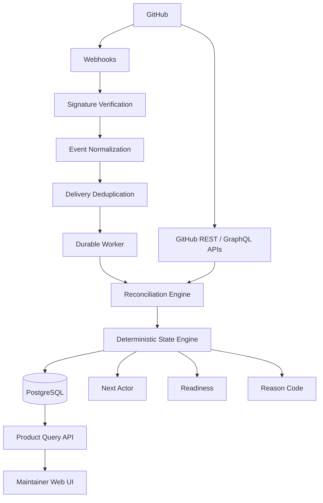

<div align="center">

# ContribOS

### GitHub-native contribution operations for deterministic pull request state, maintainer attention, readiness, evidence, and reconciliation.

[](https://github.com/AasthaPJoshi/ContribOS/releases)
[](https://github.com/AasthaPJoshi/ContribOS/actions/workflows/ci.yml)
[](LICENSE)
[](https://nodejs.org/)
[](https://www.typescriptlang.org/)

**ContribOS turns GitHub evidence into an actionable answer:**

> **What needs to happen next, who owns that action, and what evidence proves it?**

</div>

---

## Overview

ContribOS is a GitHub-native contribution operations and trust layer for maintainers and contributors.

GitHub already contains the raw evidence behind contribution workflows: pull requests, reviews, checks, statuses, mergeability, repository policy, installation metadata, and webhook events. The difficult part is turning that evidence into a reliable operational decision.

ContribOS does that deterministically.

Instead of acting as another pull request dashboard, it is designed as a lightweight **contribution control plane** that continuously answers questions such as:

- What needs attention next?
- Who owns the next action?
- Why is this contribution blocked?
- Is it ready for review?
- Is it ready to merge?
- Is the available evidence incomplete or contradictory?
- Did local state drift from GitHub after a missed, duplicated, delayed, or out-of-order event?

The core rule is intentionally strict:

> **GitHub evidence determines canonical workflow state. AI may explain or summarize that state, but AI does not decide it.**

---

## Why ContribOS

Modern contribution workflows are distributed across many GitHub surfaces. Maintainers often have to reconstruct context manually before they can make a decision.

A single pull request may require checking:

- CI results
- review state
- requested changes
- merge conflicts
- repository policy
- author activity
- installation access
- stale or incomplete webhook state
- whether an earlier event was retried or duplicated

That creates operational friction, especially as repositories and contributor volume grow.

ContribOS converts those fragmented signals into a deterministic contribution state with an explicit next actor, readiness classification, reason code, and supporting evidence.

---

## Product capabilities

| Question | ContribOS capability |
| --- | --- |
| Who needs to act next? | **Next Move Engine** |
| What requires maintainer attention now? | **Maintainer Attention Queue** |
| Is the contribution ready for review or merge? | **Contribution Readiness** |
| Why is the contribution in this state? | **Evidence Trail** |
| What if events are missed or duplicated? | **Reconciliation Engine** |
| How did the contribution evolve? | **State History / Decision Trail** |

### Next Move Engine

Evaluates repository evidence and determines the next responsible actor, such as the contributor, maintainer, CI system, or no further actor.

### Maintainer Attention Queue

Prioritizes contributions that actually require maintainer intervention so maintainers do not have to manually scan every open pull request.

### Contribution Readiness

Classifies a contribution into actionable states such as waiting on CI, waiting for review, blocked by requested changes, blocked by merge conflict, ready to merge, complete, or ambiguous.

### Evidence Trail

Persists the evidence used to reach workflow decisions so state transitions remain explainable and auditable rather than becoming opaque classifications.

### Reconciliation Engine

Uses webhooks for low-latency updates and GitHub API reconciliation for correctness. This allows ContribOS to recover from missed, duplicated, delayed, or out-of-order events and to detect local state drift.

---

## Deterministic state model

ContribOS evaluates contribution state across three primary dimensions:

- `WorkflowState`
- `NextActor`
- `Readiness`

When the available evidence is incomplete, unavailable, or contradictory, the system prefers `UNKNOWN` or `AMBIGUOUS` over inventing certainty.

Example:

```text
Pull request:       Open
Draft:              No
CI:                 Successful
Review:             Approved
Merge conflict:     No
Changes requested:  No

=> Workflow state:  READY_TO_MERGE
=> Next actor:       MAINTAINER
=> Readiness:        READY_TO_MERGE
=> Reason code:      READY_TO_MERGE
```

The value is not only the final classification. ContribOS retains the evidence and reconciliation history that explain **why** the classification was reached.

---

## Architecture



### Runtime flow

1. A GitHub App receives repository events.
2. Webhook signatures are verified before payload processing.
3. Events are normalized and deduplicated.
4. Background work is persisted and executed with retry controls.
5. GitHub APIs are queried for authoritative current state.
6. The reconciliation engine compares external evidence with persisted state.
7. The deterministic state engine evaluates contribution status and next action.
8. PostgreSQL stores contributions, evidence, reconciliation history, and state transitions.
9. The API and web application expose actionable maintainer views.

---

## Engineering principles

### Deterministic state over generated decisions

GitHub evidence remains the canonical source of truth. AI can be layered on top for explanation, summarization, contributor handoffs, and workflow hints, but it does not control state, ownership, or readiness decisions.

### Webhooks for speed, reconciliation for correctness

Webhooks keep the system responsive. Reconciliation makes the system trustworthy.

### Idempotency over optimistic event processing

External systems can send the same event more than once. ContribOS treats deduplication, safe reprocessing, and retry behavior as first-class concerns.

### Evidence before conclusions

Important state transitions should be traceable to the evidence that caused them.

### Failure recovery is part of the architecture

Retries, delivery lifecycle tracking, transactional persistence, reconciliation, graceful shutdown, and readiness checks are designed into the system rather than added after the core product is built.

### Explicit uncertainty

If evidence is insufficient, ContribOS surfaces uncertainty instead of pretending to know more than the underlying platform can prove.

---

## Reliability and production engineering

The current implementation includes:

- GitHub App authentication
- GitHub OAuth user authentication
- encrypted persisted OAuth credentials
- installation-scoped repository access
- HMAC webhook signature verification
- signature verification before payload parsing
- webhook delivery lifecycle tracking
- retry classification and recovery
- duplicate delivery protection
- duplicate active-job protection
- GitHub API reconciliation
- PostgreSQL persistence
- transactional reconciliation writes
- deterministic state history
- startup database migrations
- graceful shutdown handling
- liveness and dependency-aware readiness endpoints
- structured request logging
- request correlation identifiers
- HTTP security headers
- production configuration validation
- repository secret-hygiene checks
- Docker production builds
- automated monorepo verification
- GitHub Actions CI
- versioned release automation

---

## Technology stack

| Layer | Technology |
| --- | --- |
| Language | TypeScript |
| Runtime | Node.js 24 |
| Frontend | React + Vite |
| Database | PostgreSQL |
| Data access | Drizzle ORM |
| GitHub integration | GitHub Apps, OAuth, REST API, GraphQL API, Webhooks |
| Monorepo | pnpm + Turborepo |
| Testing | Vitest |
| Containers | Docker |
| CI/CD | GitHub Actions |
| Architecture | Event-driven processing + deterministic state machine |

---

## Repository structure

```text
ContribOS/
├── apps/
│   ├── control-plane/      # HTTP API, auth, webhook ingestion, runtime services
│   └── web/                # Maintainer-facing web application
│
├── packages/
│   ├── domain/             # Shared contribution domain contracts
│   ├── github/             # GitHub auth, API, webhook, evidence, reconciliation
│   ├── state-engine/       # Deterministic contribution-state evaluation
│   ├── db/                 # PostgreSQL schema, migrations, repositories
│   └── worker/             # Durable jobs, retry handling, orchestration
│
├── deploy/                 # Production container configuration
├── docs/                   # Product, architecture, release, and operations docs
├── scripts/                # Verification and operational tooling
└── .github/                # CI, release automation, issue and PR templates
```

---

## Development

### Requirements

- Node.js 24
- pnpm 10
- PostgreSQL
- Docker, optional but recommended for production-image verification

### Install dependencies

```sh
pnpm install
```

### Local configuration

```sh
cp .env.example .env.local
```

Configure the required local values before starting runtime services.

Never commit `.env.local`, `.secrets/`, GitHub private keys, OAuth secrets, webhook secrets, database credentials, or credential-encryption keys.

### Verify the repository

```sh
pnpm verify
```

The root verification gate runs:

```text
tests -> typecheck -> production build
```

---

## Production readiness verification

ContribOS includes a repeatable production-readiness gate:

```sh
./scripts/ops/verify-production-readiness.sh
```

It verifies:

- repository hygiene
- high-confidence tracked-secret patterns
- required security controls
- production configuration
- dependency build readiness
- targeted security tests
- the full monorepo test/typecheck/build pipeline
- the production Docker image when Docker is available

Operational guidance is maintained under [`docs/runbooks/`](docs/runbooks/).

---

## Release engineering

The repository includes automated versioned release validation.

A release candidate is expected to pass the release verification gate before a version tag is created:

```sh
./scripts/ops/verify-release.sh <version>
```

Version tags trigger the GitHub Actions release workflow, which re-runs production readiness checks before creating the GitHub Release.

**Latest public release:** [`v0.1.1`](https://github.com/AasthaPJoshi/ContribOS/releases/tag/v0.1.1)

---

## Current release boundary

ContribOS `v0.1.x` is intentionally described as a **single-instance production candidate**.

The current architecture is production-minded, but horizontal scaling requires additional distributed coordination. Planned scaling work includes:

- serialized migration ownership
- distributed worker coordination
- reconciliation concurrency controls
- sweep scheduler leader ownership
- shared rate limiting
- OAuth refresh concurrency validation
- multi-replica failure testing
- broader GitHub installation lifecycle handling

These boundaries are documented explicitly rather than presenting prototype-scale behavior as horizontally scalable production guarantees.

---

## What this project demonstrates

ContribOS was designed end to end as both a developer product and an engineering system. The repository demonstrates work across:

- product discovery and problem framing
- developer tooling and platform integration
- domain modeling
- deterministic state-machine design
- event-driven architecture
- REST and GraphQL API integration
- authentication and authorization
- relational data modeling
- transactional persistence
- background job processing
- idempotency and retry design
- failure recovery and reconciliation
- observability and health signaling
- security hardening
- containerization
- CI/CD
- release engineering
- open-source project operations

The central engineering objective is straightforward:

> **Build a system that remains understandable and predictable even when external events are duplicated, delayed, missed, incomplete, or temporarily unavailable.**

---

## Project philosophy

ContribOS treats contribution workflow state as operational infrastructure.

The system should not merely display GitHub activity. It should help a maintainer confidently answer:

> **What happened? What is blocking progress? Who acts next? And what evidence supports that decision?**

---

## Documentation

- [`CONTRIBUTING.md`](CONTRIBUTING.md) - contribution workflow and development guidance
- [`SECURITY.md`](SECURITY.md) - vulnerability reporting and security policy
- [`CODE_OF_CONDUCT.md`](CODE_OF_CONDUCT.md) - community expectations
- [`CHANGELOG.md`](CHANGELOG.md) - release history
- [`docs/runbooks/`](docs/runbooks/) - deployment and operational runbooks
- [`docs/release/`](docs/release/) - release process and versioning documentation

---

## Contributing

Contributions are welcome. Start with [`CONTRIBUTING.md`](CONTRIBUTING.md) and open an issue or pull request with focused, reviewable changes.

---

## Security

Please report security issues according to [`SECURITY.md`](SECURITY.md) rather than opening a public issue for sensitive vulnerabilities.

---

## License

Licensed under the [Apache License 2.0](LICENSE).
